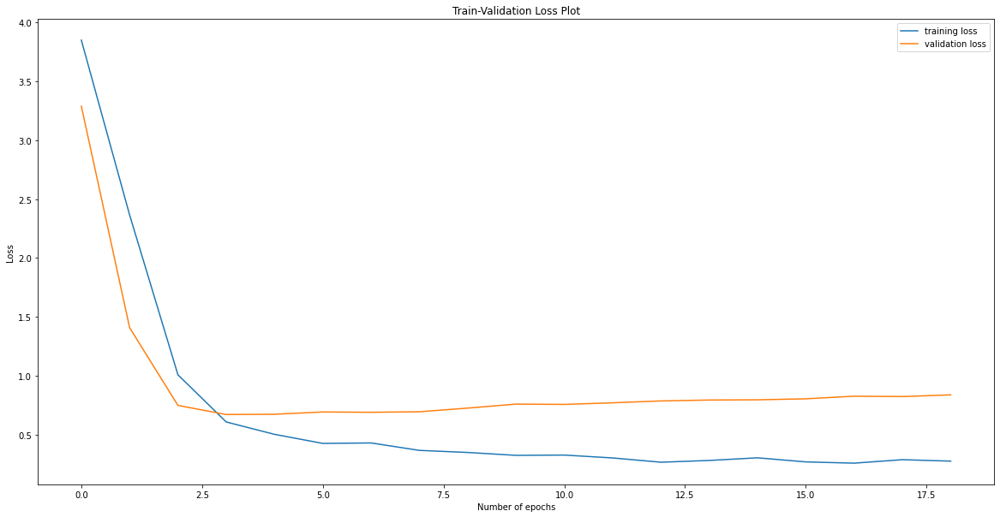

# Walk-through for Sub Task 1

## Introduction

The complete project can be replicated by running the [trainer](trainer.ipynb) Jupyter Notebook in the folder. 
The breif of the model and training procedure used is given below:
- The model is implemented using PyTorch library, so I had to create some of the standard functions like Dataset and Dataloader functions.
- Rather than creating a dataframe that contained the pixel values of each images, I created a dataframe with the path to the images and then loaded them later using the ```getitem()``` function of the Dataset class. This saves a lot of time as the files are loaded in batches than loading them all at once.
- The model used to train the images is a tweaked version of the [Zeiler and Fergus Model](https://arxiv.org/abs/1311.2901). Rather than using the standard ReLU activation I used a Leaky ReLU activation and changed the ouput dimensions to 128 L2 Normalized vectors. 
- The training is done in 2 different parts:
  - In the first part I trained the Embedding model using the novel triplet loss model as discussed in [FaceNet](https://arxiv.org/abs/1503.03832). The margin was set to 0.2 with semi-hard triplets using online triplet mining. This means that during the training time, the images of negative class (not the same as that of the current image) that lie closer to the image's embedding would be moved farther away. After training the model for around 2000 iterations, I saved the weights. The model was being validated using a simple kNN Classifier that took the generated embeddings as input and gave the respective class outputs. 
  - I then loaded the saved weights into my classifier network, that had a final softmax layer on top of the embedding model. This network was then trained to classify the images, but this time the layers of the embedding model were frozen, so that the training does not interfere with the embedding generator.
- The final saved weights are available on my [Google Drive]() in the respective folder. Since I didn't have an access to the GPU, saving the model checkpoints was not possible on CoLab as the checkpoints were lost as soon as the session was terminated.
- While the intuition behind each block is mentioned in the notebook, I have listed some of the important points in here also.


## Important points

This section contains some of the important code-snippets from the notebook and the reason I decided to try the approach.
- Turning Images to Grayscale and resizing them to (32,32). This was done keeping in mind the second sub-task where the MNIST dataset has size (28,28) and single channel. The same was done in the get item function of the dataset.
    <details><summary>View Code</summary>

    ```python
    class CustomDataset(Dataset):
        def __init__(self, imageData, imagePath, transform=None):
            self.imagePath = imagePath
            self.imageData = imageData
            self.transform = transform
        def __len__(self):
            return len(self.imageData)
        def __getitem__(self, index):
            imageName = os.path.join(self.imagePath, self.imageData.loc[index, 'Labels'],self.imageData.loc[index,'Images'])
            image = Image.open(imageName).convert('L')
            image = image.resize((32,32))
            label = torch.tensor(self.imageData.loc[index, 'Encoded Labels'])
            if self.transform is not None:
                image = self.transform(image)
            return image,label
    ```

    </details>

- The images are then upscaled to a size of (220,220) and normalized with mean and standard deviation of 0.5 using the transform function,
    <details><summary>View Code</summary>

    ```python
    transform = transforms.Compose(
        [transforms.Resize(220),
        transforms.ToTensor(),
        transforms.Normalize(mean=[0.5], std=[0.5])])
    ```
    </details>

- The next important part I would like to mention is the modified ZFNet Architecture I created. Each convolution layer in the architecture had a leaky ReLU architecture and was followed by Batch Normalization. In the end I took 128 output features which I L2 Normalized. This was done with respect to the FaceNet architecture.
    <details><summary>View Code</summary>
 
    ```python
    class EmbeddingNetwork(nn.Module):
        def __init__(self):
            super(EmbeddingNetwork, self).__init__()
            self.conv1 = nn.Sequential(
                nn.Conv2d(1, 64, (7,7), stride=(2,2), padding=(3,3)),
                nn.BatchNorm2d(64),
                nn.LeakyReLU(0.001),
                nn.MaxPool2d((3, 3), 2, padding=(1,1))
                )
            self.conv2 = nn.Sequential(
                nn.Conv2d(64,64,(1,1), stride=(1,1)),
                nn.BatchNorm2d(64),
                nn.LeakyReLU(0.001),
                nn.Conv2d(64,192, (3,3), stride=(1,1), padding=(1,1)),
                nn.BatchNorm2d(192),
                nn.LeakyReLU(0.001),
                nn.MaxPool2d((3,3),2, padding=(1,1))
                )
            self.conv3 = nn.Sequential(
                nn.Conv2d(192,192,(1,1), stride=(1,1)),
                nn.BatchNorm2d(192),
                nn.LeakyReLU(0.001),
                nn.Conv2d(192,384,(3,3), stride=(1,1), padding=(1,1)),
                nn.BatchNorm2d(384),
                nn.LeakyReLU(0.001),
                nn.MaxPool2d((3,3), 2, padding=(1,1))
                )
            self.conv4 = nn.Sequential(
                nn.Conv2d(384,384,(1,1), stride=(1,1)),
                nn.BatchNorm2d(384),
                nn.LeakyReLU(0.001),
                nn.Conv2d(384,256,(3,3), stride=(1,1), padding=(1,1)),
                nn.BatchNorm2d(256),
                nn.LeakyReLU(0.001)
                )
            self.conv5 = nn.Sequential(
                nn.Conv2d(256,256,(1,1), stride=(1,1)),
                nn.BatchNorm2d(256),
                nn.LeakyReLU(0.001),
                nn.Conv2d(256,256,(3,3), stride=(1,1), padding=(1,1)),
                nn.BatchNorm2d(256),
                nn.LeakyReLU(0.001)
                )
            self.conv6 = nn.Sequential(
                nn.Conv2d(256,256,(1,1), stride=(1,1)),
                nn.BatchNorm2d(256),
                nn.LeakyReLU(0.001),
                nn.Conv2d(256,256,(3,3), stride=(1,1), padding=(1,1)),
                nn.BatchNorm2d(256),
                nn.LeakyReLU(0.001),
                nn.MaxPool2d((3,3),2, padding=(1,1)),
                nn.Flatten()
                )
            self.fullyConnected = nn.Sequential(
                nn.Linear(7*7*256,32*128),
                nn.BatchNorm1d(32*128),
                nn.LeakyReLU(0.001),
                nn.Linear(32*128,128)
                )
        def forward(self,x):
            x = self.conv1(x)
            x = self.conv2(x)
            x = self.conv3(x)
            x = self.conv4(x)
            x = self.conv5(x)
            x = self.conv6(x)
            x = self.fullyConnected(x)
            return torch.nn.functional.normalize(x, p=2, dim=-1)
    ```
    </details>

- The model is then trained using the Triplet loss function. The margin is set to 0.2 and semi-hard triplets are mined online (while training) to train the Embedding Network (modified ZFNets). As I wanted to save the best embedding model, I tested the model using a simple kNN Classifier that took the output embeddings from the network as input and labels from the original dataset. The model was then validated on the validation set and the model having highest validation accuracy was saved.
    <details><summary>View Code</summary>

    ```python
    def tester(maxValidationAccuracy):
        trainEmbeddings = []
        trainLabels = []
        validationEmbeddings = []
        validationLabels = []
        with torch.no_grad():
            embeddingNetwork.eval()
            for (dataTr, labelTr) in (trainLoader):
                dataTr, labelTr = dataTr.to(device), labelTr.to(device)
                embeddingTr = embeddingNetwork(dataTr)
                trainEmbeddings.append(embeddingTr.cpu().detach().numpy())
                trainLabels.append(labelTr.cpu().detach().numpy())
            for (dataTe, labelTe) in (validationLoader):
                dataTe, labelTe = dataTe.to(device), labelTe.to(device)
                embeddingsTe = embeddingNetwork(dataTe)
                validationEmbeddings.append(embeddingsTe.cpu().detach().numpy())
                validationLabels.append(labelTe.cpu().detach().numpy())
        trainEmbeddings1 = []
        trainLabels1 = []
        validationEmbeddings1 = []
        validationLabels1 = []
        for bat in trainEmbeddings:
            for exm in bat:
                trainEmbeddings1.append(exm)
        for bat in trainLabels:
            for exm in bat:
                trainLabels1.append(exm)
        for bat in validationEmbeddings:
            for exm in bat:
                validationEmbeddings1.append(exm)
        for bat in validationLabels:
            for exm in bat:
                validationLabels1.append(exm)
        neigh = KNeighborsClassifier(n_neighbors=13)
        neigh.fit(trainEmbeddings1, trainLabels1)
        prediction = neigh.predict(validationEmbeddings1)
        currentAccuracy = accuracy_score(validationLabels1,prediction)
        print("Accuracy: ",currentAccuracy)
        if currentAccuracy > maxValidationAccuracy:
            maxValidationAccuracy = currentAccuracy
            print("New highest validation accuracy, saving the embedding model")
            torch.save(embeddingNetwork.state_dict(), "embeddingNetworkTask1.pt")
        return maxValidationAccuracy
    ```
    </details>

- Once I had the trained embedding network, I added two linear layers on the top of it to create my final classifier, this was done in the following manner. I created a classifierNet module, which took the embeddingNet model and added the additional layers.
    <details><summary>View Code</summary>

    ```python
    class classifierNet(nn.Module):
        def __init__(self, EmbeddingNet):
            super(classifierNet, self).__init__()
            self.embeddingLayer = EmbeddingNet
            self.linearLayer = nn.Sequential(nn.Linear(128, 64), nn.ReLU())
            self.classifierLayer = nn.Linear(64,62)
            self.dropout = nn.Dropout(0.5)

        def forward(self, x):
            x = self.dropout(self.embeddingLayer(x))
            x = self.dropout(self.linearLayer(x))
            x = self.classifierLayer(x)
            return F.log_softmax(x, dim=1)
    ```    
    </details>

- I then created an instance of this network, while passing my best embedding network and froze the layers of embedding network.
    <details><summary>View Code</summary>

    ```python
    bestEmbeddingNetwork = EmbeddingNetwork().to(device)
    bestEmbeddingNetwork.load_state_dict(torch.load('embeddingNetworkTask1.pt'))
    classifier = classifierNet(embeddingNetwork).to(device)
    for param in classifier.embeddingLayer.parameters():
        param.requires_grad = False
    ```
    </details>

- Since my classification network has ```log_softmax``` output so I trained the network using the NegativeLogLike(NLL) loss function. The learning rate was set to ```0.01``` and I used an Adam optimizer. And trained my classifier network.
    <details><summary>View Code</summary>

    ```python
    criterion = nn.NLLLoss()
    optimizer = torch.optim.Adam(classifier.parameters(), lr=0.01)
    ```
    </details>

## Training Results and Conclusions

Below are the results for the classfication network. Note that both of the networks used the same inputs from the Embedding network and were validated on the same split of 15%.
- Using kNN Classifier with 13 nearest neighbors: 81.45161290322581%
- Using a neural network with two linear layers on top of the embedding network: 81.72043010752688%
As we can see that both the kNN and the neural network works equally well on the dataset, this can be explained by the following lines that are quoted from FaceNet paper:
    > Once this embedding has been produced, then the aforementioned tasks become straight-forward: face verification simply involves thresholding the distance between the two embeddings; recognition becomes a k-NN classification problem; and clustering can be achieved using off-theshelf techniques such as k-means or agglomerative clustering.

So my results here proved the same. Once we have the L2 normalized embeddings from a network trained using the Triplet loss, a kNN classifier using those embeddings performs at par with a neural network.
- One important point to note here is that the above mentioned neural network used for this task outperforms many of the sophisticated deep neural networks like ResNet18, ResNet34 and the traditional VGG Nets.
- Another important point to be noted at this stage is the difference between the training and validation loss and accuracy in the neural network. The plots are shown in the figures below:
    <details>
    <summary>View Training vs Validation Loss</summary>

    
    </details>
    <details>
    <summary>View Training vs Validation Accuracy</summary>

    
    </details>
    - The graphs here show that the model is over-fitting when being trained on the neural network. 
    - The same does not happens when being trained using the kNN Classifier. This can be explained by the paper itself:
        > Previous face recognition approaches based on deep networks use a classification layer [15, 17] trained over a set of known face identities and then take an intermediate bottleneck layer as a representation used to generalize recognition beyond the set of identities used in training. The downsides of this approach are its indirectness and its inefficiency: one has to hope that the bottleneck representation generalizes well to new faces; and by using a bottleneck layer the representation size per face is usually very large (1000s of dimensions). Some recent work [15] has reduced this dimensionality using PCA, but this is a linear transformation that can be easily learnt in one layer of the network.
    - So in my case since the embedding layer was frozen, the model couln't generalize the linear layers and hence gave high validation losses.
    - This can be avoided by the use of simple machine learning techniques like a kNN Classifier or some other clustering methods, as shown above the kNN classifier works at par with the neural network.
  
## Rejected methods:
Apart from the modified ZFNets I also used the following neural networks:
- ResNet18: performed well on the first sub-task but failed during the second sub-task.
- ResNet34: performed well on the first sub-task but failed during the second sub-task.

## Citations
While I tried to write most the code from my own knowledge, I took important sections from the following tutorials and blogs. I have also mentioned the Literature I reffered to:
- [PyTorch Tutorial - Victor Basu](https://www.kaggle.com/basu369victor/pytorch-tutorial-the-classification)
- [PyTorch Metric Learning Tutorial- Kevin Musgrave](https://github.com/KevinMusgrave/pytorch-metric-learning/blob/master/examples/notebooks/TripletMarginLossMNIST.ipynb)
- [FaceNet](https://arxiv.org/pdf/1503.03832.pdf)
- [Visualizing and Understanding Convolutional Networks](https://arxiv.org/abs/1311.2901) 


