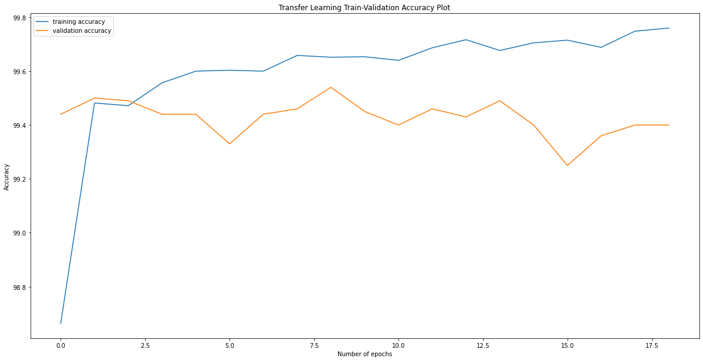
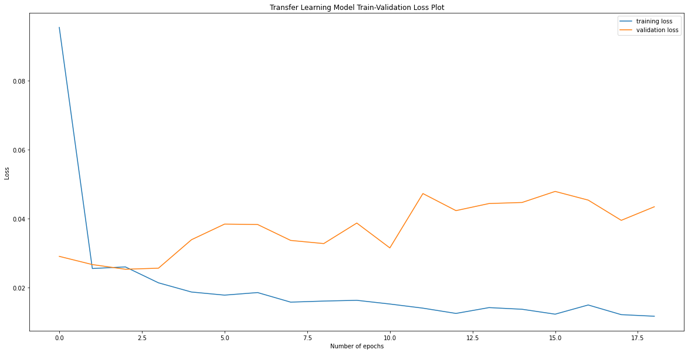
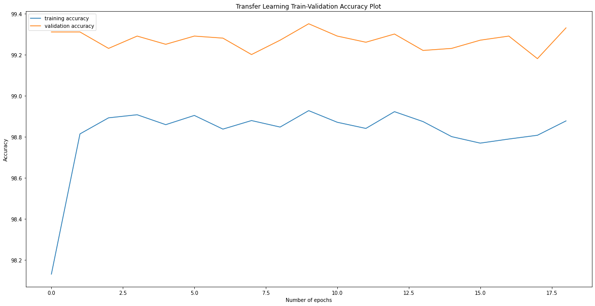
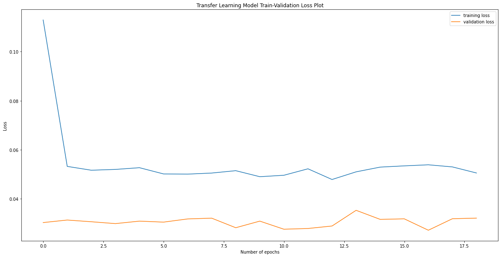

# Walk-through for Sub Task 1

## Introduction
The complete project can be replicated by running the two notebooks, notebook for Pre-Trained model on MNIST: [Notebook-1](subTaskTwoNotebook1.ipynb) and notebook for scratch model on MNIST: [Notebook-2](subTaskTwoNotebook2.ipynb) in the folder.
The breif for the task is mentioned below:
- For the first part of this sub task, just like SUB TASK 1, I used the modified ZFNets architecture to train the model on the provided dataset. Once the embedding network was trained, I fine-tuned the embedding network on the MNIST dataset's original test train split. 
- For the second part of this sub task, I just downloaded the MNIST dataset, used the train split to train my embedding network first, then used the same split to train my classfication network. And then tested the classification network on the test split.

## Important Points
Most of the points here remain the same as sub task 1. Some of the important details that are different are mentioned below.
- I upscaled the MNIST Images from (28,28) to (220,220). This made the images similar to the provided dataset.
- I fine-tuned my embedding network on the pre-trained model before training the classifier for the first part. This was done as:
    <details><summary>Show Code</summary>

    ```python
    maxValidationAccuracyMNIST = 0.0
    def testerMNIST(maxValidationAccuracyMNIST):
        trainEmbeddings = []
        trainLabels = []
        validationEmbeddings = []
        validationLabels = []
        with torch.no_grad():
        embeddingNetwork.eval()
        for (dataTr, labelTr) in (mnistTrainLoader):
            dataTr, labelTr = dataTr.to(device), labelTr.to(device)
            embeddingTr = embeddingNetwork(dataTr)
            trainEmbeddings.append(embeddingTr.cpu().detach().numpy())
            trainLabels.append(labelTr.cpu().detach().numpy())
        for (dataTe, labelTe) in (mnistTestLoader):
            dataTe, labelTe = dataTe.to(device), labelTe.to(device)
            embeddingsTe = embeddingNetwork(dataTe)
            validationEmbeddings.append(embeddingsTe.cpu().detach().numpy())
            validationLabels.append(labelTe.cpu().detach().numpy())
        trainEmbeddings1 = []
        trainLabels1 = []
        validationEmbeddings1 = []
        validationLabels1 = []
        for bat in trainEmbeddings:
            for exm in bat:
                trainEmbeddings1.append(exm)
        for bat in trainLabels:
            for exm in bat:
                trainLabels1.append(exm)
        for bat in validationEmbeddings:
            for exm in bat:
                validationEmbeddings1.append(exm)
        for bat in validationLabels:
            for exm in bat:
            validationLabels1.append(exm)
        neigh = KNeighborsClassifier(n_neighbors=13)
        neigh.fit(trainEmbeddings1, trainLabels1)
        prediction = neigh.predict(validationEmbeddings1)
        currentAccuracy = accuracy_score(validationLabels1,prediction)
        print("Accuracy: ",currentAccuracy)
        if currentAccuracy > maxValidationAccuracyMNIST:
            maxValidationAccuracyMNIST = currentAccuracy
            print("New highest validation accuracy, saving the embedding model")
            torch.save(embeddingNetwork.state_dict(), "embeddingNetworkMNIST.pt")
        return maxValidationAccuracyMNIST
    ```

    </details>
- The embedding model having best validation accuracy was saved and then I finally trained the classifier using the embedding model on the MNIST train split and validated the results.
- I then trained the embedding model from scratch using the same architecture. The embedding model was trained for 5 epochs only (the number of epochs I used to fine tune the embedding model). I then saved the model having highest validation score on the kNN Classifier.
- Both of the models, the fine-tuned one and the one trained from scratch perform exceptionally well and took no time to converge. The models performed equally in terms of comparision.
- The above acheivement can be attributed to the novel triplet loss. All the images were transformed into 128 dimensional feature vectors and hence the models converged fast, even without any pre-training.
- The losses and accuracy plots for both of the trainings is shown below:
    <details><summary>Training and Validation stats on MNIST for pre-trained model</summary>

    
    

    </details>

    <details><summary>Training and Validation stats on MNIST for scratch model</summary>

    
    

    </details>
- As we can see both of the models performed equally well right from the start, so comparing them is a bit difficult.
- But here once again the fine-tuned model started overfitting, as the embedding layers were frozen and the model could not generalize on them. 
- This does not happen in the case of the model which was trained from scratch, as in this case the embedding layers were trained on the same dataset.
  
## Citations
While I tried to write most the code from my own knowledge, I took important sections from the following tutorials and blogs. I have also mentioned the Literature I reffered to:
- [PyTorch Tutorial - Victor Basu](https://www.kaggle.com/basu369victor/pytorch-tutorial-the-classification)
- [PyTorch Metric Learning Tutorial- Kevin Musgrave](https://github.com/KevinMusgrave/pytorch-metric-learning/blob/master/examples/notebooks/TripletMarginLossMNIST.ipynb)
- [FaceNet](https://arxiv.org/pdf/1503.03832.pdf)
- [Visualizing and Understanding Convolutional Networks](https://arxiv.org/abs/1311.2901)